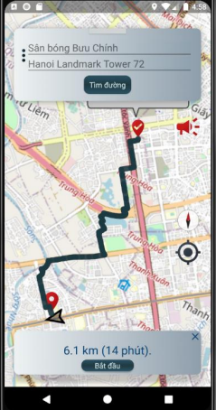
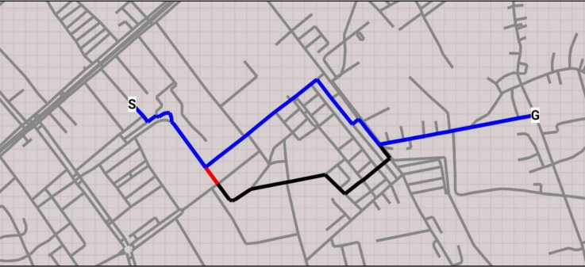
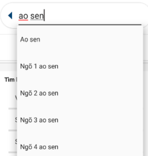

# A self-hosting Ha Noi Maps Service
Tags: A* algorithm, inverted index, pathfinding, openstreetmap, haversine distance, mercator projector, osmdroid

- Android App demo: https://github.com/yehshuhua/appda2020
- My graduation thesis: https://drive.google.com/file/d/1UGwpUggGJzAXCKf5XP3-ec5a6Zcmy8r4/view?usp=sharing

# API
**GET /places**: getListPlaceByName(name)    //searching location

**GET /locations**: getLocationByPoint(lat,lng)      //when user click on map

**GET /roads**: getRoadByPoint(lat,lng)      //show nearest edge if location not in graph

**GET /directions**: getDirection(from,to)      //A* algorithm

# Data
Raw data from https://www.openstreetmap.org/export

## Graph

Generate graph (E,V) from raw data: `/pre_processing/FileGenerator.java`

vertex.txt: (id | latitude | longitude)
* 84849316 20.9604061 105.8131604
* 84849317 20.9605819 105.8134018
* 84849318 20.9608304 105.8137365
* ...

egde.txt: (id1 | id2)
* 1706698186 3511597208
* 3511597208 3511597207
* 3511597207 6658315197
* ...

## Location
Filter name from raw data: `/pre_processing/NameFilter.java`

name.txt: (index | name | nearest_vertex)
* 70::Học viện Y dược học cổ truyền Việt Nam ~ ::5710591076
* 71::Đường Nguyễn Trãi ~ ::5710591076
* 72::Duy Shop - 283 Vũ Tông Phan ~ Khương Trung, Thanh Xuân::6610973025
* 73::Số 283 Vũ Tông Phan ~ Khương Trung, Thanh Xuân::6610973025
* ...

## Searching
Inverted Index from name.txt: `/pre_processing/InvertedIndex.java`

inverted_index.txt: (term | list_index)
* hang = {44,47,49,189,219,300,302,568,592,598,655}
* hanh = {176,185,619,827}
* nghe = {66,801,913,1359}
* vm+ = {543,544,545,546,558,559,560,561,562}
* xom = {194,755,840,872,873,884}
* ...

result:

